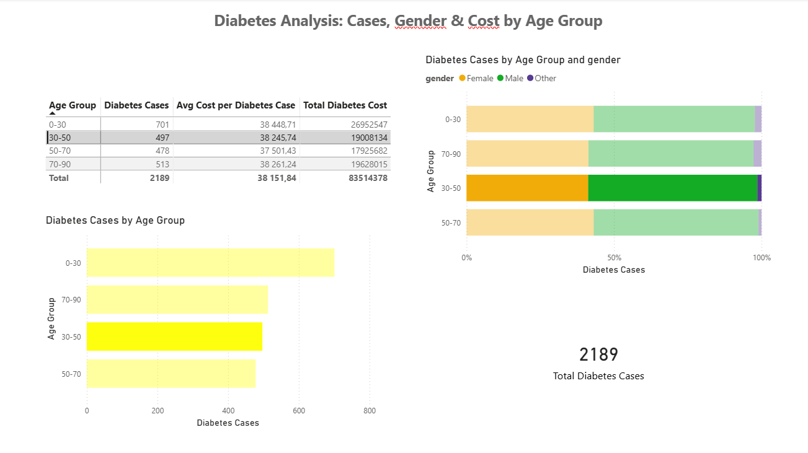

# 🏥 Power BI Healthcare Dashboard

## 📌 Overview
This dashboard analyzes **diabetes cases** from a hospital admissions dataset (45,000+ records). It shows:
- **Distribution of cases** by age group
- **Gender breakdown** across age groups
- **Cost analysis**: total cost and average cost per case

## 📊 Key Insights
| Age Group | Cases | Avg Cost | Total Cost |
|-----------|-------|----------|------------|
| 0-30 | 701 | $38,449 | $26.95M |
| 30-50 | 497 | $38,246 | $19.01M |
| 50-70 | 478 | $37,501 | $17.93M |
| 70-90 | 513 | $38,261 | $19.63M |
| **Total** | **2,189** | **$38,152** | **$83.51M** |

## 🔍 Insight
- **Youngest age group (0-30)** has the highest number of diabetes cases (701) and highest total cost ($26.95M)
- Males show higher prevalence across all age groups
- Average cost per case is consistent across age groups (~$38,000)

## 🛠️ Tools Used
- Power BI Desktop
- DAX measures
- Data from [Hospital HMIS Dataset](https://www.kaggle.com/datasets/shalakagangurde/hospital-hmis-dataset-for-healthcare-analytics)

## 📸 Dashboard Preview

## 📬 Contact
**Miriam González** – [LinkedIn](https://linkedin.com/in/miriam-gonzalez-a8793a381)